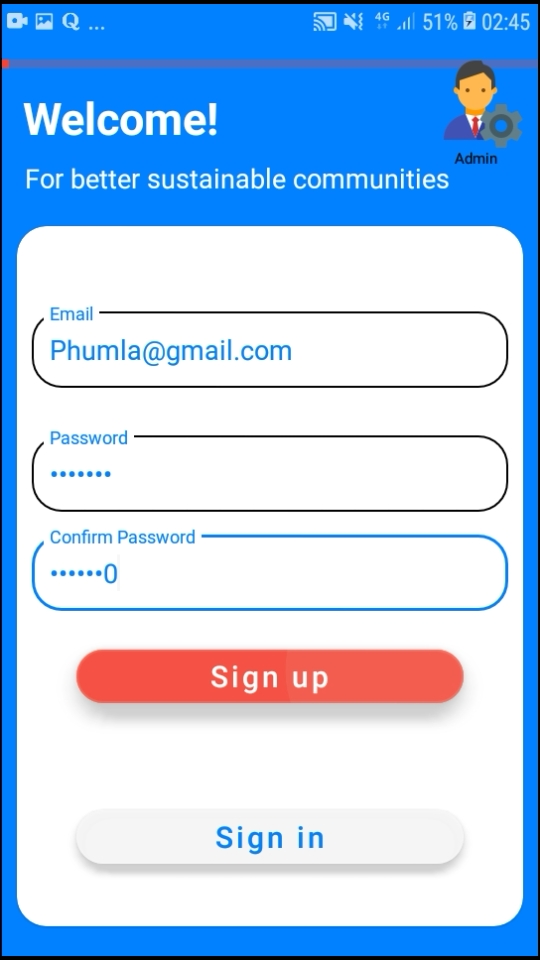
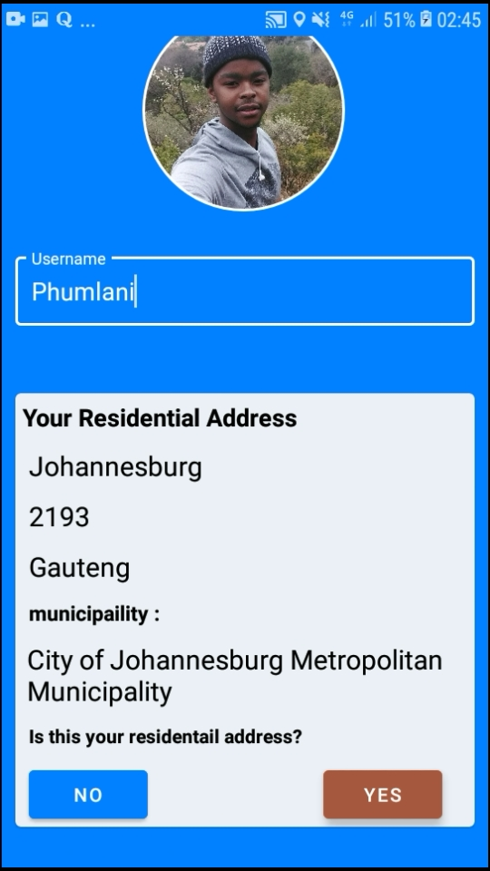
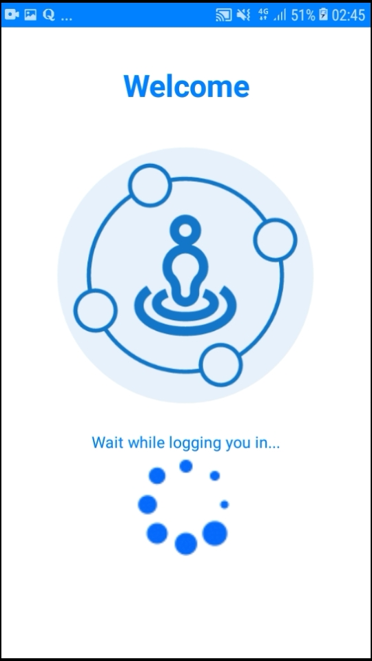
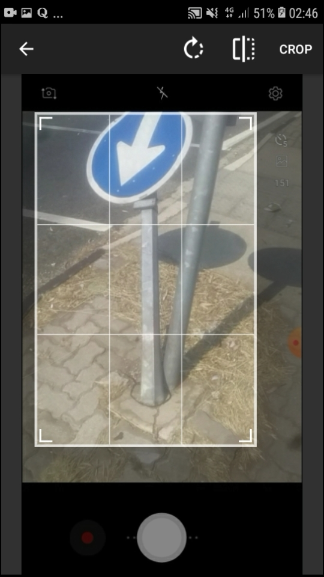
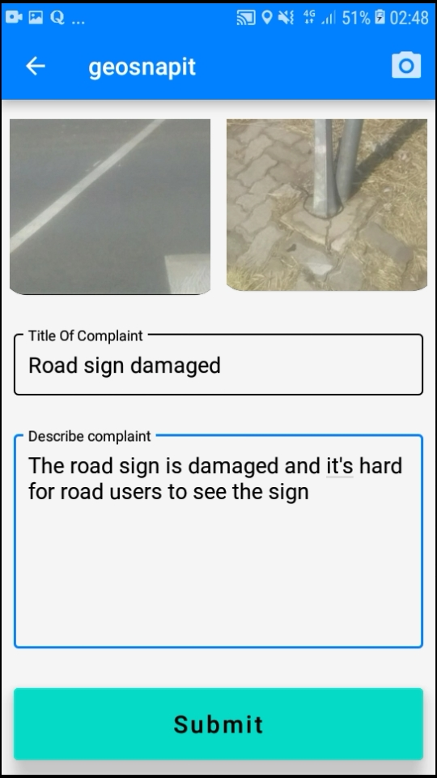
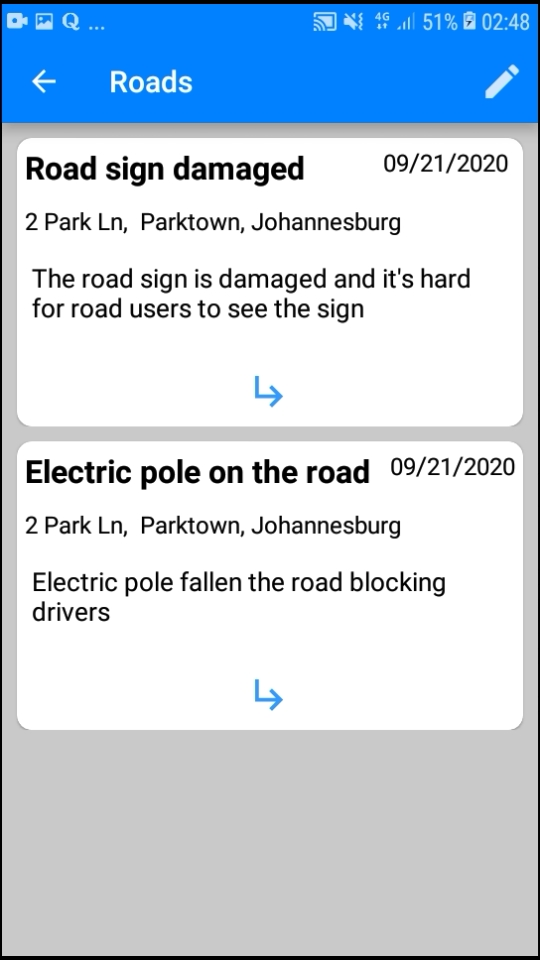
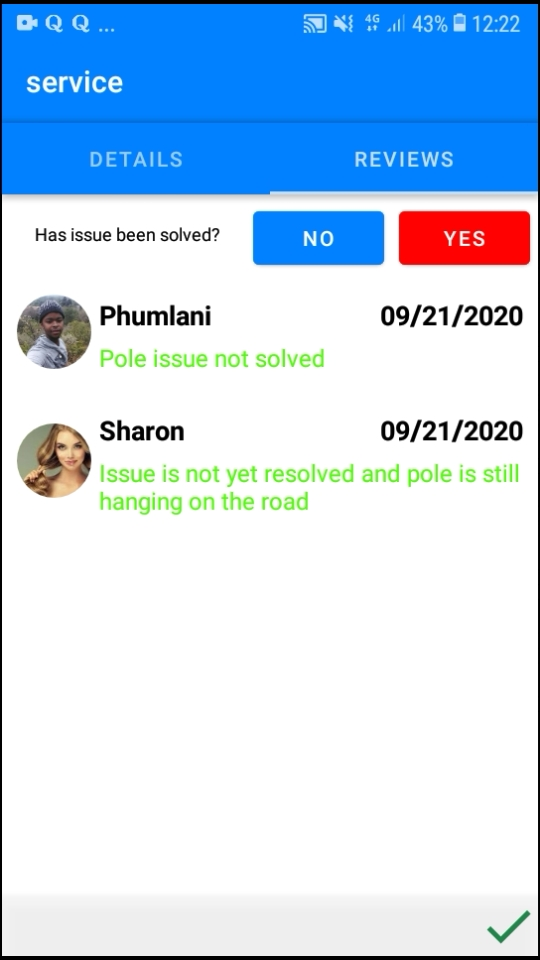

# Geosnapit

Android mobile app created to improve service delivery and develop better communities by allowing active participation from citizens

 
  
       
  
                  
  
    


#### create a google API key to use geolocator

### Clone from github

Click clipboard under clone or download

### Clone on terminal
Make sure you are in the folder where you want to clone the project. If you are not then just type:


```terminal
cd theDesiredFolderLocation
```
Next command: 
```terminal
git clone copiedLinkPath
```

## Contributing
Pull requests are welcome. For major changes, please open an issue first to discuss what you would like to change. Have fun with the project.

Please make sure to update tests as appropriate.

## License
[MIT](https://choosealicense.com/licenses/mit/)
